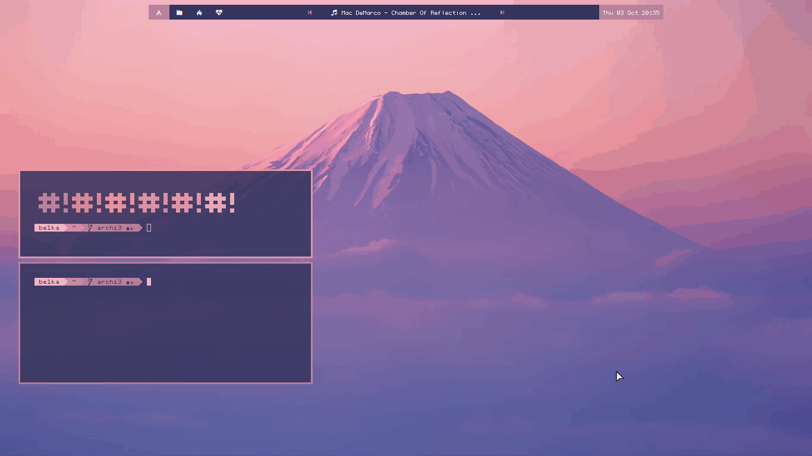

# Mustream

Exploit to stream music from spotify using your terminal. 

### Try it!
``` bash
curl -s https://raw.githubusercontent.com/BelkaDev/Mustream/master/play | bash -s Ryo Scenery
```

## Description 
 The script will look up for the most relevant result following a set of keywords. </br>
 Ideally you should specify the complete track info ( $artist - $title ) for more 
 accurate results. </br>
 No sign up nor premium subscriptions are required. </br> </br>
  </img>
 
## Features:
Queue up any track/album/playlist from the spotify library.

## Usage :
* Type a song title or artist name for a quick search. </br>
* Add prefix `Album`/`Playlist` for respective results. </br>
* You can direcly enter a playlist URL. </br>
* Spotify client must be running.

## Notes and tricks :
* This script doesn't include a client manager </br>
I suggest you use SP (https://gist.github.com/wandernauta/6800547) for this
purpose.
* you can explore playlists by adding the prefix `some`, this will return </br>
a playlist related to your input, this option offers more flexibility to your search </br>
as you can use it to look up for artists,tags,albums without restrictions. </br>
* the minus delimiter can be used to ignore keywords: `-remix -live`
* acronyms are valid for many bands: </br>
   - `play some PF` will queue up a Pink Floyd playlist</br>
* Some songs may not start due to country restrictions.

## Installation :
#### AUR Package
The script is available in AUR for Archlinux users, you can install it with any AUR helper
```
yay -S mustream-git
```
#### From source
```
git clone https://github.com/BelkaDev/mustream ~/mustream && cd ~/mustream && chmod +x play
```
